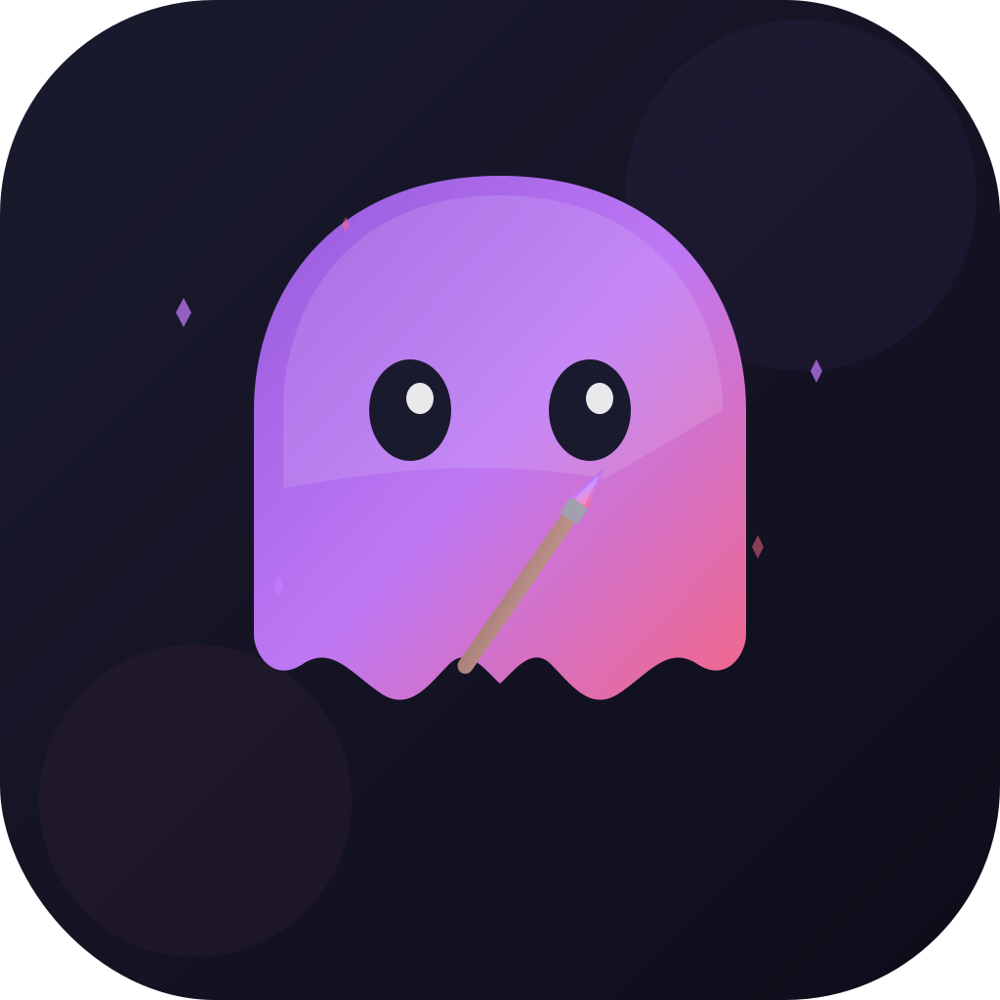

<p align="center">
  
</p>

<h1 align="center">Style Phantom</h1>

<p align="center">
  <strong>Map your creative evolution. Discover where your taste is heading.</strong>
</p>

<p align="center">
  
  
  
  
  
  
  
</p>

<p align="center">
  <em>A macOS-native creative intelligence tool that captures the invisible evolution of your personal aesthetic taste and generates "next evolution" palettes, layouts, and structures you didn't know you wanted — all processed entirely on-device.</em>
</p>

---

## What It Does

You import your creative work — designs, photos, illustrations, mood boards — and Style Phantom builds a map of your aesthetic journey:

1. **Extracts** a 33-dimensional style vector from each piece (color, composition, texture, complexity)
2. **Clusters** your work into aesthetic phases using k-means with automatic cluster selection
3. **Computes** your style trajectory — the direction your taste is moving over time
4. **Projects** forward to generate palettes, layouts, and compositions aligned with your natural creative evolution

Think of it as a GPS for your creative taste. You see where you've been, where you are now, and where you're naturally heading.

---

## Quick Start

### Pre-built App

```bash
# Clone the repository
git clone https://github.com/salvadalba/nodaysidle-stylephantom.git
cd nodaysidle-stylephantom

# Build and package the .app bundle
bash Scripts/compile_and_run.sh

# Install to Applications
cp -R StylePhantom.app /Applications/
```

### From Source

```bash
# Build (debug)
swift build

# Build (release)
swift build -c release

# Run tests
swift test
```

### Requirements

- macOS 15+ (Sequoia)
- Apple Silicon (M1 or later)
- Xcode Command Line Tools or Xcode 16+
- Swift 6.2+

---

## The Interface

```
┌──────────────┬─────────────────────┬──────────────────────┐
│   Sidebar    │      Gallery        │       Detail         │
│              │                     │                      │
│  All Items   │  ┌───┐ ┌───┐ ┌───┐ │   [Selected Image]   │
│              │  │   │ │   │ │   │ │                      │
│  PHASES      │  └───┘ └───┘ └───┘ │   Imported: Feb 2026 │
│  ● Minimal   │  ┌───┐ ┌───┐ ┌───┐ │   Phase: Minimalist  │
│  ● Bold      │  │   │ │   │ │   │ │                      │
│  ● Textured  │  └───┘ └───┘ └───┘ │   DOMINANT COLORS    │
│              │                     │   ■ ■ ■ ■ ■          │
│  ─────────── │                     │                      │
│  + Import    │                     │   COMPOSITION        │
│  ↻ Recompute │                     │   Symmetry ████░░ 72%│
└──────────────┴─────────────────────┴──────────────────────┘
```

**Three-column NavigationSplitView** with dark theme and violet accent:

- **Sidebar** — Aesthetic phases detected by AI clustering, import and recompute actions
- **Gallery** — Grid of imported artwork with thumbnails, hover effects, and phase indicators
- **Detail** — Style dimensions breakdown: color palette, composition bars, texture, complexity

### Evolution Viewer

Switch to the Evolution Viewer to see a side-by-side comparison of your **current phase** and **projected direction**. Drag horizontally to interpolate between them in real-time. Export the result to your design tools.

### Timeline Scrubber

The bottom timeline shows your aesthetic phases as colored bands. Drag the scrubber to travel through your creative history.

---

## Architecture

```
Sources/StylePhantom/
├── StylePhantomApp.swift          # App entry point, MenuBarExtra
├── Models/
│   ├── CreativeArtifact.swift     # @Model — imported artwork
│   ├── AestheticPhase.swift       # @Model — clustered style period
│   ├── StyleProjection.swift      # @Model — projected future style
│   ├── StyleVector.swift          # 33-dim vector encoding/decoding
│   ├── PaletteColor.swift         # RGBA color with hex & naming
│   ├── LayoutGrid.swift           # Grid system representation
│   ├── UserPreferences.swift      # Singleton settings model
│   ├── ModelContainerFactory.swift # SwiftData container setup
│   └── SchemaV1.swift             # Versioned schema migration
├── Views/
│   ├── ContentView.swift          # Root NavigationSplitView
│   ├── SidebarView.swift          # Phase list, actions
│   ├── ArtifactGalleryView.swift  # Grid gallery with search/sort
│   ├── ArtifactDetailView.swift   # Full detail panel
│   ├── EvolutionViewerView.swift  # Drag-to-refine comparison
│   ├── TimelineScrubberView.swift # Canvas-based timeline
│   ├── ImportSheetView.swift      # Drag & drop import
│   ├── ExportDialogView.swift     # Format picker + preview
│   ├── SettingsView.swift         # App preferences
│   └── EmptyStateView.swift       # Contextual empty states
├── ViewModels/
│   ├── ImportViewModel.swift      # Import workflow state
│   ├── GalleryViewModel.swift     # Gallery + thumbnail cache
│   ├── SidebarViewModel.swift     # Evolution recomputation
│   ├── EvolutionViewModel.swift   # Phase interpolation
│   └── ExportViewModel.swift      # Export workflow + NSSavePanel
├── Services/
│   ├── ArtifactImportService.swift    # File validation, thumbnails, bookmarks
│   ├── StyleVectorExtractor.swift     # Image → 33-dim vector
│   ├── EvolutionEngine.swift          # K-means clustering + trajectory
│   ├── ProjectionGenerator.swift      # Kinematic style projection
│   ├── ExportService.swift            # Multi-format export engine
│   └── Logging.swift                  # os.Logger + OSSignposter
├── CoreML/
│   └── ColorQuantizer.swift       # K-means color quantization
├── Metal/
│   └── TimelineShaders.metal      # GPU shaders for timeline visuals
└── Theme/
    └── PhantomTheme.swift         # Design system (colors, gradients, animations)
```

### Key Design Decisions

| Decision | Choice | Why |
|----------|--------|-----|
| Concurrency | Swift 6 strict | Zero data races, future-proof |
| Observation | `@Observable` only | No Combine, cleaner reactivity |
| Style vectors | 33 dimensions | 20 color + 8 composition + 4 texture + 1 complexity |
| Clustering | k-means++ with elbow method | Auto-selects optimal phase count |
| Projection | Kinematic (`pos + vel*t + 0.5*acc*t^2`) | Captures acceleration of taste changes |
| Shaders | Metal `[[ stitchable ]]` | SwiftUI 6 ShaderLibrary integration |
| Binary export | ASE (Adobe Swatch Exchange) | Native Photoshop/Illustrator compatibility |
| Logging | `os.Logger` + `OSSignposter` | Instruments profiling, zero overhead when disabled |

---

## Export Formats

### Palettes

| Format | Extension | Use Case |
|--------|-----------|----------|
| **JSON** | `.json` | Design tokens, CI/CD pipelines |
| **CSS** | `.css` | Web development, CSS custom properties |
| **ASE** | `.ase` | Adobe Photoshop, Illustrator, InDesign |

### Layouts

| Format | Extension | Use Case |
|--------|-----------|----------|
| **JSON** | `.json` | Design token systems |
| **SVG** | `.svg` | Visual grid overlay, documentation |
| **Figma Tokens** | `.json` | Figma Token Studio plugin |

---

## Testing

```bash
# Run all 73 tests across 17 suites
swift test
```

Test coverage includes:

- **Model tests** — SwiftData persistence, relationships, cascade deletes, schema migration
- **Import tests** — File validation, thumbnail generation, duplicate detection, bookmark security
- **Evolution tests** — K-means clustering, elbow method, trajectory computation, kinematic projection
- **Export tests** — ASE binary encoding (byte-level verification), JSON/CSS/SVG format validation, logging

---

## Privacy

All processing runs **entirely on your Mac**. No data leaves your device. No telemetry, no analytics, no cloud AI. Your creative work stays yours.

---

## Tech Stack

- **SwiftUI 6** — Declarative UI with `NavigationSplitView`, `Canvas`, sheets
- **SwiftData** — Persistent models with versioned schemas and relationships
- **Metal** — GPU-accelerated timeline shaders (`[[ stitchable ]]`)
- **Swift Testing** — Modern test framework with `@Suite`, `@Test`, `#expect`
- **os.Logger** — Structured logging with `OSSignposter` for Instruments
- **SwiftPM** — Pure Swift Package Manager build (no Xcode project required)

---

## License

MIT

---

<p align="center">
  <sub>Built with SwiftUI 6 + SwiftData + Metal on Apple Silicon</sub>
</p>
